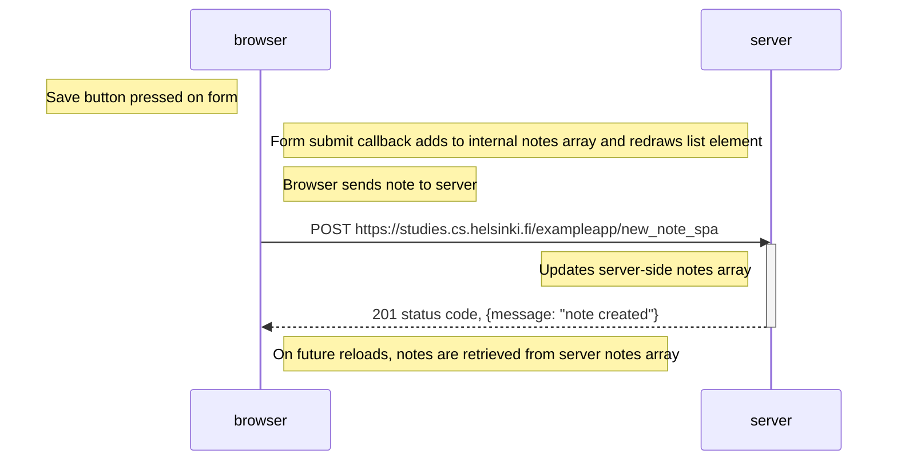

```mermaid
sequenceDiagram
    participant browser
    participant server

    Note left of browser: Save button pressed on form
    Note right of browser: Form submit callback adds to internal notes array and redraws list element
    Note right of browser: Browser sends note to server 
    browser->>server: POST https://studies.cs.helsinki.fi/exampleapp/new_note_spa
    activate server
    Note left of server: Updates server-side notes array 
    server-->>browser: 201 status code, {message: "note created"}
    deactivate server

    Note right of browser: On future reloads, notes are retrieved from server notes array
```